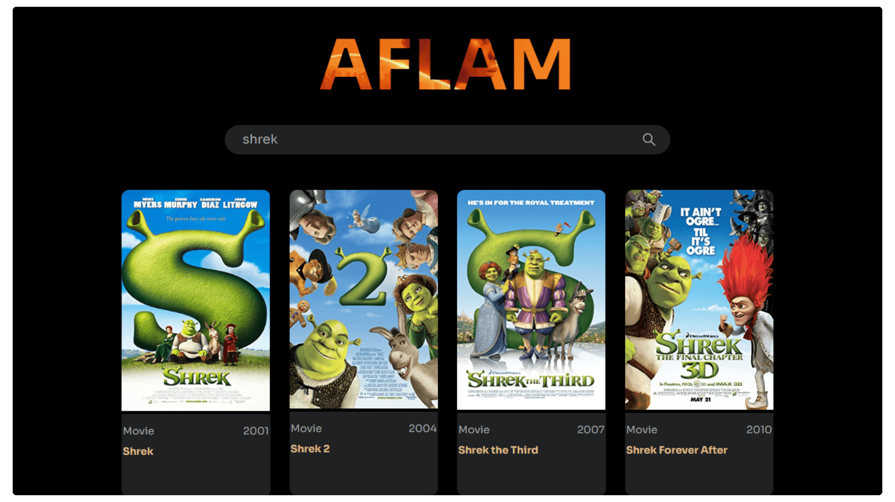

<div align="left">
  <h2 align="left">Aflam - Movie App</h2>
  
  
  [](https://twitter.com/intent/follow?screen_name=mabiorduom)
  
  

  A simple react movie app using OMDb API to fetch data and return a movie or series based on user input.

</div>

### Preview


### Prerequisites
* [Node.Js](https://nodejs.org/) ([Setup Instructions](https://nodejs.org/en/download/package-manager/))

* [OMDb API](https://www.omdbapi.com/apikey.aspx)

### Getting Started

Create react-app using vite:

```sh
npm create vite@latest aflam-app --template React
cd aflam-app
```

Install packages and dependencies:

```sh
npm i or npm install
```

Run server:

```sh
npm run dev
```

## License
This project is licensed under the MIT License - see the [LICENSE](LICENSE) file for details